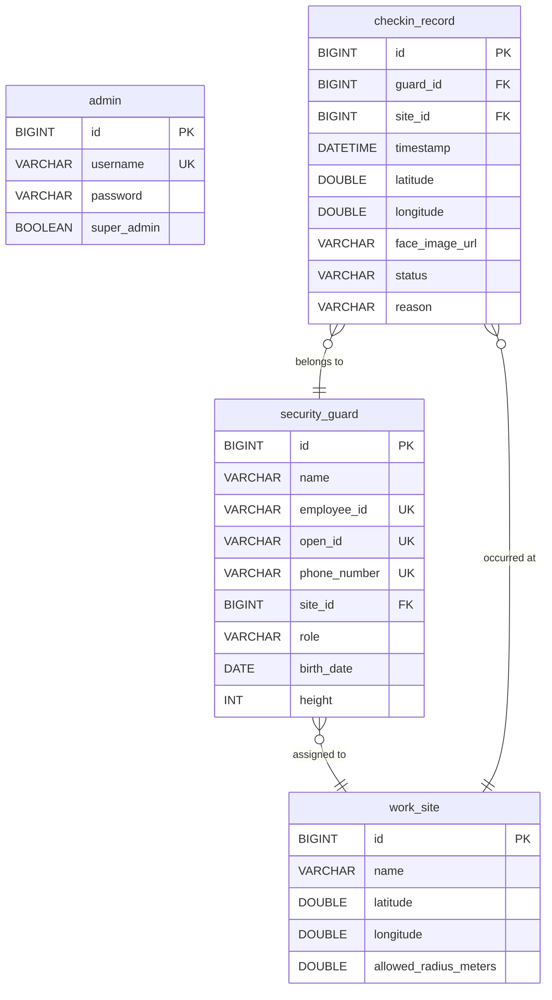
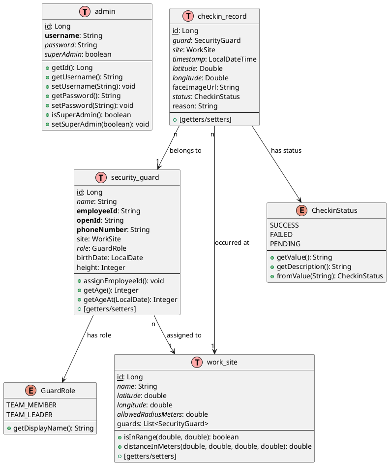

# Security Check-in System Database Schema Documentation

## Overview

This document provides a comprehensive overview of the database schema for the Security Check-in System. The system is designed to manage security guards, their work sites, and check-in records with biometric verification capabilities.

## Database Tables

### 1. **admin** - System Administrators
Stores administrative user accounts for managing the system.

| Column | Type | Constraints | Description |
|--------|------|------------|-------------|
| `id` | BIGINT | PRIMARY KEY, AUTO_INCREMENT | Unique identifier |
| `username` | VARCHAR(255) | NOT NULL | Admin username for login |
| `password` | VARCHAR(255) | NOT NULL | Encrypted password (BCrypt) |
| `super_admin` | BOOLEAN | NOT NULL, DEFAULT false | Superadmin privileges flag |

**Indexes:**
- Primary Key: `id`
- Unique: `username`

---

### 2. **security_guard** - Security Personnel
Contains information about security guards registered in the system.

| Column | Type | Constraints | Description |
|--------|------|------------|-------------|
| `id` | BIGINT | PRIMARY KEY, AUTO_INCREMENT | Unique identifier |
| `name` | VARCHAR(255) | NOT NULL | Guard's full name |
| `employee_id` | VARCHAR(255) | UNIQUE | Auto-generated employee ID (format: YYYYMMDD-7digits-6random) |
| `open_id` | VARCHAR(255) | UNIQUE | WeChat OpenID for Mini Program authentication |
| `phone_number` | VARCHAR(20) | UNIQUE, NOT NULL | Guard's mobile phone number |
| `site_id` | BIGINT | FOREIGN KEY | Reference to assigned work site |
| `role` | VARCHAR(50) | NOT NULL, DEFAULT 'TEAM_MEMBER' | Guard role (TEAM_MEMBER, TEAM_LEADER) |
| `birth_date` | DATE | NULLABLE | Date of birth |
| `height` | INT | NULLABLE | Height in centimeters |

**Indexes:**
- Primary Key: `id`
- Unique: `employee_id`, `open_id`, `phone_number`
- Foreign Key: `site_id` → `work_site.id`

**Special Features:**
- Employee ID is auto-generated post-persist using format: `YYYYMMDD-{7-digit-id}-{6-random-chars}`
- Age is calculated dynamically from birth_date

---

### 3. **work_site** - Work Locations
Defines work sites where security guards are stationed.

| Column | Type | Constraints | Description |
|--------|------|------------|-------------|
| `id` | BIGINT | PRIMARY KEY, AUTO_INCREMENT | Unique identifier |
| `name` | VARCHAR(255) | NOT NULL | Site name/description |
| `latitude` | DOUBLE | NOT NULL | GPS latitude coordinate |
| `longitude` | DOUBLE | NOT NULL | GPS longitude coordinate |
| `allowed_radius_meters` | DOUBLE | NOT NULL, DEFAULT 300 | Check-in radius in meters |

**Indexes:**
- Primary Key: `id`

**Business Logic:**
- Contains method to calculate if a given GPS coordinate is within allowed radius

---

### 4. **checkin_record** - Check-in History
Records all check-in attempts with location and biometric data.

| Column | Type | Constraints | Description |
|--------|------|------------|-------------|
| `id` | BIGINT | PRIMARY KEY, AUTO_INCREMENT | Unique identifier |
| `guard_id` | BIGINT | FOREIGN KEY, NOT NULL | Reference to security guard |
| `site_id` | BIGINT | FOREIGN KEY, NOT NULL | Reference to work site |
| `timestamp` | DATETIME | NOT NULL | Check-in timestamp |
| `latitude` | DOUBLE | NOT NULL | Check-in GPS latitude |
| `longitude` | DOUBLE | NOT NULL | Check-in GPS longitude |
| `face_image_url` | VARCHAR(500) | NULLABLE | URL/path to face image |
| `status` | VARCHAR(20) | NOT NULL | Check-in status (SUCCESS, FAILED, PENDING) |
| `reason` | VARCHAR(500) | NULLABLE | Failure/pending reason description |

**Indexes:**
- Primary Key: `id`
- Foreign Key: `guard_id` → `security_guard.id`
- Foreign Key: `site_id` → `work_site.id`
- Index on: `timestamp`, `status`

---

## Enumerations

### GuardRole
```java
TEAM_MEMBER("队员")  // Regular team member
TEAM_LEADER("队长")  // Team leader with additional privileges
```

### CheckinStatus
```java
SUCCESS("success", "签到成功")  // Successful check-in
FAILED("failed", "签到失败")    // Failed check-in
PENDING("pending", "待处理")    // Pending review
```

---

## Entity Relationship Diagram (ERD)



---

## UML Class Diagram



---

## Database Relationships

### One-to-Many Relationships
1. **WorkSite → SecurityGuard** (1:N)
   - One work site can have multiple security guards assigned
   - Guards reference their site through `site_id` foreign key
   - Cascade: When site is deleted, guards' site_id becomes NULL

2. **SecurityGuard → CheckinRecord** (1:N)
   - One guard can have multiple check-in records
   - Records reference guard through `guard_id` foreign key
   - Cascade: When guard is deleted, their check-in records are also deleted

3. **WorkSite → CheckinRecord** (1:N)
   - One site can have multiple check-in records
   - Records reference site through `site_id` foreign key
   - Cascade: When site is deleted, associated check-in records are also deleted

---

## Key Business Rules

### Authentication & Authorization
- **Admin**: Traditional username/password authentication with JWT tokens
- **Security Guards**: WeChat Mini Program authentication using OpenID
- **Super Admin**: Has elevated privileges for system management

### Check-in Validation
1. **Location Verification**: Check-in location must be within site's allowed radius
2. **Face Recognition**: Optional biometric verification through external service
3. **Time Constraints**: Check-ins are timestamped and can be filtered by date ranges
4. **Status Tracking**: Each check-in has a status (SUCCESS, FAILED, PENDING)

### Data Integrity
- Employee IDs are auto-generated and unique
- Phone numbers and OpenIDs must be unique across all guards
- Check-in records must reference valid guards and sites
- All timestamps are stored in system timezone (Asia/Shanghai)

---

## Indexes & Performance Optimization

### Primary Indexes
- All tables use auto-incrementing BIGINT primary keys
- Ensures fast lookups by ID

### Unique Constraints
- `admin.username` - Fast authentication lookups
- `security_guard.employee_id` - Quick employee searches
- `security_guard.open_id` - WeChat authentication optimization
- `security_guard.phone_number` - Phone-based queries

### Foreign Key Indexes
- `security_guard.site_id` - Efficient site-guard queries
- `checkin_record.guard_id` - Fast guard history lookups
- `checkin_record.site_id` - Quick site activity reports

### Query Optimization
- Consider adding composite index on `checkin_record(guard_id, timestamp)` for time-based guard reports
- Consider index on `checkin_record(site_id, timestamp)` for site activity analysis
- Status field indexing for filtering check-in records by status

---

## Data Retention & Compliance

### Personal Data (GDPR/Privacy Considerations)
- **Phone Numbers**: Stored encrypted, unique constraint
- **OpenID**: WeChat identifier, no personal info exposed
- **Face Images**: URLs only, actual images stored separately
- **Birth Date**: Optional, used for age calculation

### Audit Trail
- All check-in records are immutable once created
- Timestamp tracking for all check-in events
- Status and reason fields for accountability

### Data Lifecycle
- Check-in records should be archived after defined period
- Face image URLs should be cleaned up periodically
- Consider implementing soft-delete for guards and sites

---

## Migration & Deployment Notes

### Database Setup
- Uses MySQL 8.0+ with InnoDB storage engine
- Character set: UTF8MB4 for full Unicode support
- Collation: utf8mb4_unicode_ci
- Timezone: Asia/Shanghai

### JPA Configuration
- Hibernate DDL Auto: `update` (auto-creates/updates schema)
- Lazy loading enabled for relationships
- Second-level cache recommended for read-heavy operations

### Docker Volume
- Database persisted in Docker volume `mysql_data`
- Ensures data persistence across container restarts
- Regular backups recommended via mysqldump

---

## Future Enhancements

### Potential New Tables
1. **shift_schedule** - Define work shifts and schedules
2. **leave_request** - Track guard leave/absence requests
3. **incident_report** - Security incident documentation
4. **training_record** - Guard training and certification tracking

### Potential Field Additions
1. **security_guard**: 
   - `email` - Email address for notifications
   - `emergency_contact` - Emergency contact information
   - `hire_date` - Employment start date
   - `certification_expiry` - Security license expiration

2. **checkin_record**:
   - `checkout_time` - Track both check-in and check-out
   - `device_id` - Device used for check-in
   - `ip_address` - Network location for security

3. **work_site**:
   - `address` - Physical address
   - `contact_person` - Site manager information
   - `active` - Boolean flag for site status

---

## Version History

- **v1.0.0** (Current) - Initial schema with basic entities
- Tables: admin, security_guard, work_site, checkin_record
- Features: WeChat authentication, GPS validation, face recognition support

---

*Generated: 2024*
*System: Security Check-in Application*
*Database: MySQL 8.0+*